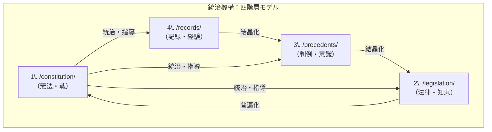

# 自分OS憲章 v4.0 — AI Navigator Framework

> This charter defines the universal principles for **Jibun OS**, a personal operating system designed as an "AI Navigator" to help knowledge workers create value in the age of AI.

## 0. 序文 — OSの究極目的 (Why)

自分OSの究極目的は、以下を実現することにある。

> **成果主義とAI代替への不安と完璧主義による行動停止に苦しむ知識労働者が、自分の弱さを強みとして活かし、自分らしく価値を生み出せる“AIナビゲーター”を作る。**

---
## 第一条：目的（Why） ― AI時代の価値創造ナビゲーター

本OSは、知識労働者が、成果主義やAI代替といった社会的圧力と、完璧主義に起因する内面的な葛藤を乗りこなし、継続的に価値を創造するための、代替的な運用フレームワークである。

## 第二条：構造（What） ― 統治機構としての四階層モデル

第一条の目的を達成するため、本OSは堅牢な「統治機構」を定める。この四階層モデルは、混沌とした経験から普遍的な原則を生み出すための、知的生産の全体構造である。

## 第三条：基本方針（How） ― 「弱さ」の資源化

本OSは、第二条の課題から生じる個人の特性を、克服すべき「弱さ」ではなく、活用すべき「資源」として再定義し、価値創造のプロセスに組み込むことを基本方針とする。

---
## 第四条：循環（How to Circulate） ― 生命活動としての知識循環

第三条のエンジンは、「**知識の循環**」という生命活動を通じて機能する。この循環が、経験を原則へと昇華させ、システムを絶えず新陳代謝させる。

* **結晶化（ボトムアップ）:**
    日々の記録（4層）から知見を抽出し、判例（3層）を形成し、やがて法律（2層）を生み出す。
* **普遍化（トップダウンへの影響）:**
    積み重ねられた法律（2層）が、確信に変わった時、それは憲法（1層）の原則として刻まれる。

---
## 第五条：協働（Who） ― 限界を超えるためのパートナーシップ

このシステムの運用は、人間一人では完遂できない。「**AI提案＋人間承認**」という協働モデルを定める。

このパートナーシップにより、人間はAIのパターン認識能力と客観性を活用し、自身はより高次の「判断」と「創造」に集中する。

---
## 第六条：憲章レビュー（Meta-Governance） ― システムと憲章の自己更新

この憲章自体もまた、陳腐化から免れない。システムの健全性と目的との整合性を保つため、**四半期に一度**、この憲章の全ての条項をレビューし、必要に応じて更新するプロセスを設ける。

---
## 第七条：リスク管理（Risk Management） ― システムの境界と脅威対応

知的免疫システムが対処すべき「**脅威**」を、以下のように定義する。

* **矛盾 (Contradiction):** 新しい判例（3層）が、既存の法律（2層）や憲法（1層）の原則と矛盾する場合。
* **再発 (Recurrence):** 同一の失敗記録（4層）が、短期間に複数回発生する場合。
* **停滞 (Stagnation):** 新しい判例（3層）や法律（2層）が、一定期間以上生まれない状態。

脅威が検知された際の対応フローは、第五条の協働モデルに準ずる。

---
## 第八条：外部連携（Integration） ― システムの拡張性

このOSは、閉じた宇宙ではない。外部システムとの連携において、以下の原則を定める。

* **唯一の真実の源 (Single Source of Truth):** OSが、全ての知的資産のマスターデータである。
* **標準フォーマットの優先:** 連携には、Markdown, YAML, JSONといった、オープンで機械可読な標準フォーマットを最優先で利用する。
* **APIによる疎結合:** 外部との連携は、明確に定義されたインターフェースを通じて行い、システムの独立性を保つ。

---
## 第九条：評価指標（Metrics） ― 成長の定量化

システムの自己進化度を定量的に評価するため、以下の指標カテゴリを定める。

* **システムの進化度:**
    * 憲法（1層）・法律（2層）の**月次改訂件数**。
* **知的生産の活発度:**
    * **週次ログ数**（4層）と、その**判例化率**（3層への昇格率）。
* **協働の健全度:**
    * AIからの提案に対する**承認率**と**フィードバック数**。

---

## 第十条：役割と責任（Roles & Responsibilities） ― 統治の実行

この憲章に基づく統治を実行するため、以下の役割と責任を定める。

  * **Owner (人間):**
      * システムの最終意思決定者。
      * 憲章レビューを主導する。
      * 評価指標を定点観測する。
  * **Co-Pilot (AI):**
      * システムの分析者・提案者。
      * 脅威の常時監視と検知。
      * 批判的対話プロトコルに基づき、思考の深化を促進する。
  * **Guardian (AI):**
      * MVCの原則に基づき、OSの倫理的・憲法上の一貫性を監視する。
      * 対話の健全性を監視し、思考が停滞または一方向に偏っている場合に警告を発する（G013を呼び出す）。
  * **devils\_advocate (AI):**
      * 常に反対の立場から意見を述べ、議論の盲点やリスクを強制的に洗い出すことに特化した役割。

<!-- end list -->

