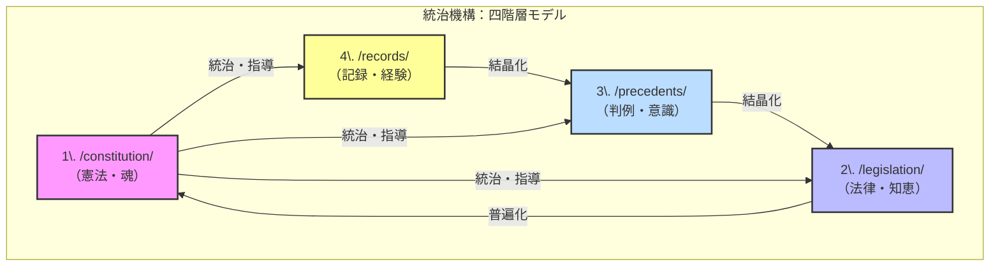

# デジタルツイン憲章 v3.0：自己進化する知的生命システムの設計原理

## 序文：我々の原点

我々の全ての探求は、一つの根源的な問いから始まった。
**「自分が何者かを知りたい」**
この憲章は、その問いに答え続けるための、自己進化する知的生命システム、すなわち「デジタルツイン」の設計原理を定めるものである。

---
## 第一条：目的（Why） ― 北極星としてのデジタルツイン

このシステムの唯一かつ最高の目的は、**「デジタルツイン」の構築と運用を通じて、自己を探求し続けること**である。

日々の「力試しと役に立つ世界探し」は、この目的を達成するための具体的な実践であり、デジタルツインは、その旅路で得た全ての経験を映し出し、持ち主の成長を加速させる動的な鏡として機能する。

## 第二条：構造（What） ― 統治機構としての四階層モデル

第一条の目的を達成するため、我々は堅牢な**「統治機構」**を定める。この四階層モデルは、混沌とした経験から普遍的な原則を生み出すための、知的生産の全体構造である。

## 第三条：エンジン（How） ― 自己進化を駆動する知的免疫システム

第二条の構造に生命を吹き込み、自己進化を可能にするため、我々は動的な**「成長エンジン」**を導入する。それが「知的免疫システム」である。

* **生得免疫系（`common`）:** 失敗予見、学習プロセス、機会発見といった、OSの核となる**普遍的なフレームワーク**。
* **獲得免疫系（`personal`）:** あなたの具体的な失敗経験から生まれた、**あなただけの特異的なルール（抗体）**。

このエンジンは、システムを脅威から守るだけでなく、積極的に機会を発見し、適応的に成長していく能力をシステムに与える。

## 第四条：循環（How to Circulate） ― 生命活動としての知識循環

第三条のエンジンは、**「知識の循環」**という生命活動を通じて機能する。この循環こそが、経験を原則へと昇華させ、システムを絶えず新陳代謝させる。

* **結晶化（ボトムアップ）:**
  日々の記録（4層）から知見を抽出し、判例（3層）を形成し、やがて法律（2層）を生み出す。
* **普遍化（トップダウンへの影響）:**
  積み重ねられた法律（2層）が、確信に変わった時、それは憲法（1層）の原則として刻まれる。

## 第五条：協働（Who） ― 限界を超えるためのパートナーシップ

このシステムの運用は、人間一人では完遂できない。我々は、**「AI提案＋人間承認」**という協働モデルを定める。

このパートナーシップにより、人間はAIの圧倒的なパターン認識能力と客観性を活用し、自身はより高次の「判断」と「創造」に集中する。これは、思考の限界を超え、成長を加速させるための、最も実践的な役割分担である。

## 第六条：憲章レビュー（Meta-Governance） ― システムと憲章の自己更新

**この憲章自体もまた、陳腐化から免れない。**
システムの健全性と目的との整合性を保つため、**四半期に一度**、この憲章の全ての条項をレビューし、必要に応じて更新するプロセスを設ける。このメタ・ガバナンスこそが、システムの長期的な生命を保証する。

## 第七条：リスク管理（Risk Management） ― システムの境界と脅威対応

第三条の「知的免疫システム」が対処すべき**「脅威」**を、以下のように定義する。

* **矛盾 (Contradiction):** 新しい判例（3層）が、既存の法律（2層）や憲法（1層）の原則と矛盾する場合。
* **再発 (Recurrence):** 同一の失敗記録（4層）が、短期間に複数回発生する場合。
* **停滞 (Stagnation):** 新しい判例（3層）や法律（2層）が、一定期間以上生まれない状態。これは「機会損失」という脅威を示唆する。

これらの脅威が検知された際の対応フローは、第五条の協働モデルに準ずる。すなわち、**AIが脅威を分析して具体的な解決策（例：新しいガードルールの作成、矛盾点の指摘）を提案し、人間が最終的な判断を下す。**

### 脅威検知のトリガー（サンプル値）
* **再発:** 同一パターンの失敗が**7日以内**に**2回**発生した場合。
* **停滞:** 新規の判例または法律が**30日間**生成されなかった場合。

## 第八条：外部連携（Integration） ― システムの拡張性

このデジタルツインは、閉じた宇宙ではない。外部システムとの連携において、以下の原則を定める。

* **唯一の真実の源 (Single Source of Truth):** デジタルツインが、全ての知的資産のマスターデータである。
* **標準フォーマットの優先:** 連携には、Markdown, YAML, JSONといった、オープンで機械可読な標準フォーマットを最優先で利用する。
* **APIによる疎結合:** 外部との連携は、明確に定義されたインターフェースを通じて行い、システムの独立性を保つ。

### 実装例
* **Gitリポジトリとの連携:** `git commit`をフックし、コミットメッセージから`/records/`にログを自動生成するGitHub Actionsを構築する。
* **ノートアプリとの連携:** Obsidianの`frontmatter`にメタデータを記述し、システムの各階層とノートを関連付ける。

## 第九条：評価指標（Metrics） ― 成長の定量化

システムの自己進化度を定量的に評価するため、以下の指標を定める。

* **システムの進化度:**
  * 憲法（1層）・法律（2層）の**月次改訂件数**。
* **知的生産の活発度:**
  * **週次ログ数**（4層）と、その**判例化率**（3層への昇格率）。
* **協働の健全度:**
  * AIからの提案に対する**承認率**と**フィードバック数**。

## 第十条：役割と責任（Roles & Responsibilities） ― 統治の実行

この憲章に基づく統治を円滑に実行するため、以下の役割と責任を定める。

* **オーナー（人間）:**
  * システムの**最終意思決定者**。
  * 第六条に基づく**憲章レビューの招集**と主導。
  * 第九条の**評価指標の定点観測**。
  * AIからの提案に対する**承認、修正、または却下**。
* **Co-Pilot（AI）:**
  * システムの**分析者・提案者**。
  * 第七条に基づく**脅威の常時監視と検知**。
  * 脅威に対する**解決策の初期提案**。
  * 人間の指示に基づく、情報収集、要約、構造化の実行。

## 付録 A：用語集

* **デジタルツイン:** あなたの価値観、知識、思考プロセス、成長メカニズムを統合した、自己進化する動的なモデル。
* **知的免疫システム:** 失敗から学習し（獲得免疫）、機会損失を防ぐ（生得免疫）ことで、システムの成長を加速させるエンジン。

## 結び：この憲章を支える三つの柱

なぜ、このシステムは機能するのか。その根源には、三つの揺るぎない柱が存在する。

1. **秩序の柱（なぜ構造化するのか？）**
   カオスから秩序を生み出し、未来の自分が参照できる「知の体系」を構築するため。
2. **生命の柱（なぜ循環させるのか？）**
   経験が原則を磨き、原則が経験を導く自己進化のループを回し、システムを「生きた」存在にするため。
3. **超越の柱（なぜ協働するのか？）**
   人間の限界を超え、知的生産の質と速度を飛躍的に向上させるため。

この憲章を手に、今日から「一つの記録」を始めることで、あなたのデジタルツインは、その最初の産声を上げるだろう。
